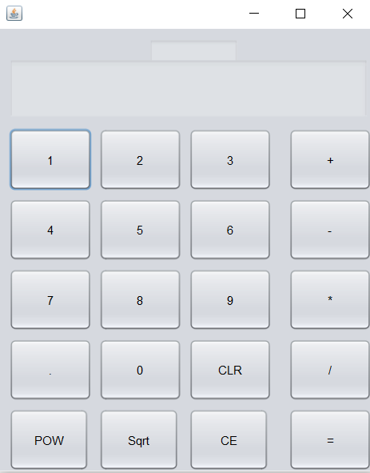

# 📱 Java Stack-Based Calculator

This is a simple **stack-based calculator** built using **Java Swing** for the graphical user interface (GUI). It utilizes a **custom Stack implementation** inside the same file as the calculator logic to handle mathematical operations efficiently.

## 🚀 Features
- **Basic Operations**: Addition, Subtraction, Multiplication, Division
- **Advanced Functions**: Power, Square Root
- **Custom Stack Implementation**: Manages numbers and operations without using Java's built-in `Stack` class
- **Interactive GUI**: Built using Java Swing

## 📂 Project Structure
```
📁 CalculatorProject
 ├── 📄 Calculator.java        # Main calculator logic and custom Stack class
 ├── 📄 README.md              # Project documentation
 ├── 📁 assets                 # (Optional) Store any images/icons for the UI
```

## 🛠️ How to Run
### **Prerequisites**
- Java Development Kit (JDK) installed (JDK 8 or later)
- Any Java IDE (IntelliJ, Eclipse, NetBeans, or VS Code with Java extensions)

### **Steps to Run**
1. **Clone the repository**
   ```sh
   git clone https://github.com/yourusername/calculator-project.git
   cd calculator-project
   ```
2. **Compile the Java file**
   ```sh
   javac Calculator.java
   ```
3. **Run the application**
   ```sh
   java Calculator
   ```

## 📝 Usage
1. Enter numbers into the display.
2. Use the operation buttons (`+`, `-`, `×`, `÷`, `√`, `^`) to perform calculations.
3. The custom stack handles calculations in **Last-In-First-Out (LIFO)** order.
4. Click "Clear" to reset the calculator.

## 🔧 Custom Stack Class Overview
This project includes a custom `Stack` class inside `Calculator.java` with:
- `push(double x)`: Adds an element to the stack.
- `pop()`: Removes and returns the top element.
- `peek()`: Returns the top element without removing it.
- `isEmpty()`: Checks if the stack is empty.
- `isFull()`: Checks if the stack is full.
- `printStack()`: Prints all stack elements.

## 📷 Screenshot


## 🤝 Contributing
1. Fork the project.
2. Create a new branch (`git checkout -b feature-branch`).
3. Commit your changes (`git commit -m 'Added new feature'`).
4. Push to the branch (`git push origin feature-branch`).
5. Open a Pull Request.

## 📜 License
This project is licensed under the MIT License - see the [LICENSE](LICENSE) file for details.

## 📬 Contact
For any questions or feedback, feel free to reach out via:
- **GitHub Issues**
- **Email: your.email@example.com**

---

🎯 *Happy Coding!* 🚀
